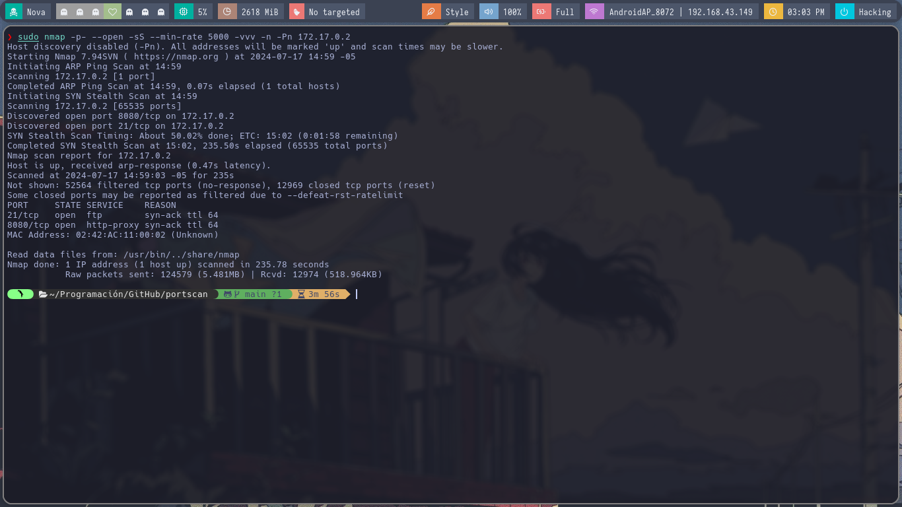

# Portscan Script

Este script es una herramienta simple para escanear puertos abiertos en una IP específica utilizando `nc`.

## Imágenes

### Ejecución del Script


El tiempo de ejecución del script fue de 1 minuto y 33 segundos.

### Resultado con nmap


Usando nmap, el escaneo optimizado se completó en 3 minutos y 56 segundos.

## Uso

1. Clonar el repositorio:
    
    ```sh
    git clone https://github.com/anonymous-17-03/portscan.git
    cd portscan
    ```

2. Asignar permisos de ejecución al script:
    
    ```sh
    chmod +x portscan.sh
    ```

3. Ejecutar el script para escanear una IP específica:
    
    ```sh
    ./portscan.sh -i <IP>
    ```

## Ejemplo

```sh
./portscan.sh -i 172.17.0.2
```

